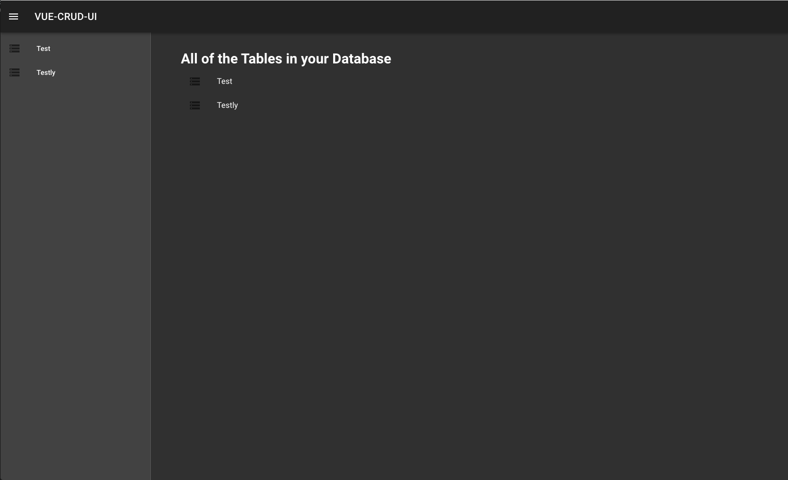
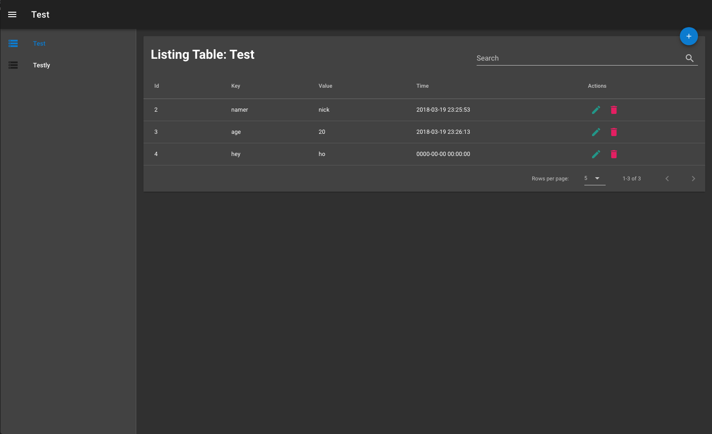
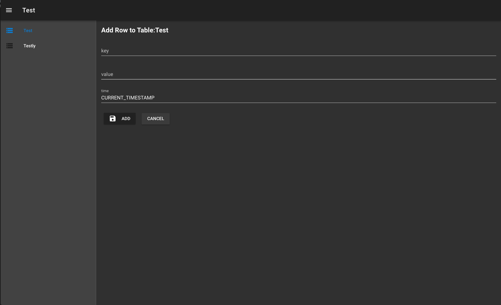
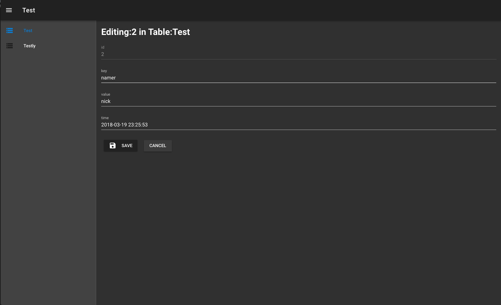

# VUE-CRUD-UI

Single file Vue.js script that adds a UI to a [PHP-CRUD-API](https://github.com/mevdschee/php-crud-api) project

 * Able to list all tables of database
 * Create, Read, Update and Delete any table's row
 * With nicer interface

 
 
 
 